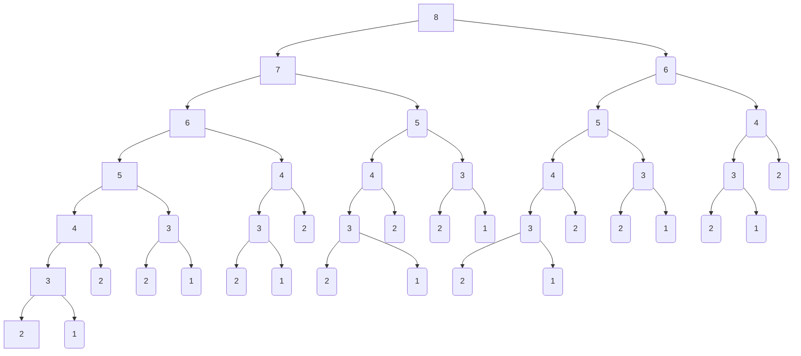

## 递归

当一个函数调用它自己来定义时称它为递归函数。（什么叫它自己调用它自己呢？）

### 1.1、引出递归

从一个简单的问题考虑递归，求0，1，2， 3，4，5......n的和。

首先定义一个求和公式：sum(n);

显然对于（n > 0）： sum(n) = sum(n - 1) + n ;

​               （n = 0 ） :  sum(0) = 0;

​				成立。

将上述公式翻译成C++函数：

```c++
unsigned int sum(unsigned int n)
{
    if(0 == n)
    {
        return 0; //基准情况(递归的出口)，sum不能一直调用它自己吧，总归要有一个出口结束递归吧
    }
    else
    {
        return sum(n - 1) + n; //sum(unsigned int)调用了它自己
    }
}

```

假设 n = 5 分析一下计算过程：

*sum(5) = sum(4) + 5;*

*sum(4) = sum(3) + 4;*

*sum(3) = sum(2) + 3;*

*sum(2) = sum(1) + 2;*

*sum(1) = sum(0) + 1;*  

*sum(0) = 0;*      当sum(0)时，sum()不再调用它自己，作为递归的出口结束递归。

假设没有n = 0, sum(0) = 0 这个基准情况作为递归的出口跳出递归，递归就会一直递归下去，没完没了直至崩溃。*因此递归函数必须有一个基准情况作为递归出口*。


### 1.2、失败的递归

给出一个所谓的递归函数：

```c++
int bad(unsigned int n)
{
    if(0 == n)
    {
        return 0;
    }
    else
    {
        return bad(n/3 + 1) + n - 1;
    }
}
```

分析一下以上函数，函数给出了 n = 0 的情况作为递归的出口，看似没什么问题。

还是假设n = 5；

bad(5) ： 调用bad(5/3 + 1), 即bad(2);

bad(2)  :   调用bad(2/3 + 1), 即bad(1);

bad(1)  :   调用bad(1/3 + 1), 即bad(1);

bad(1)  :   调用bad(1/3 + 1), 即bad(1)..........

bad(1)一直调用bad(1), 一直调用到程序崩溃。很明显bad()函数定义虽然给出了 n = 0 作为递归出口，但是bad()函数根本不会推进到n = 0 的这种情况。*因此递归调用必须总能够朝着产生基准情况（递归出口）的方向推进*。


### 1.3、递归和归纳

考虑一个问题：现在需要将一个正整数 n 打印出来，但是I/O给出的函数接口(printDigit)只能处理单个数字（即n < 10）。

我们随便假设一个n值：n = 2019，那么单个数字打印的顺序就是2， 0， 1， 9。换句话说，9是最后一个打印的，在打印9之前要先打印201，即先打印“201”，再打印“9”；依次类推对于“201”先打印“20”，再打印“1”；对于“20”先打印“2”，再打印“0”；对于2已经是单个数字，可以直接打印了, 不需要再划分，再递归了，也就是说单个数字n < 10即为递归的出口。

我们按上述思路细致的分析一下：

对2019分成2部分: 201 = 2019 / 10;  9  = 2019 % 10; 

对201分成2部分：20 = 201 / 10; 1 = 201 % 10;

对20分成2部分：2 = 20 / 10; 0 = 20 % 10;

对于 2 满足 n < 10 的条件，不再递归，直接打印。

现在递归已经很明显了，尝试编写一下代码：

```c++
//假设printDigit((unsigned int n)如下，
void printDigit(unsigned int n)
{
    std::cout << n;
}

void print(unsigned int n)
{
    if(n >= 10)
    {
        print(n / 10);
    }
    printDigit(n % 10);
}
```

代码编写好了，现在需要证明以下代码是否正确：对于n >= 0，数的递归打印算法总是正确的。

**证明：**用k表示数字n的包含单个数字的个数。当k = 1，即 n < 10 时，很明显程序是正确的，因为它不需要递归，print()只调用一次printDigit(), 不调用它自己。然后假设print()对于所有k位数都能正常工作，任何k + 1位的数字n都可以通过它的前k位的数字和最低1位数字来表示。前k 位的数字恰好是[ n / 10],  归纳假设它能正常工作，而最低1位数字是[ n % 10]，因此该程序能够正确的打印出任意k + 1位。于是根据归纳法[^归纳法]，所有数字都能被正确打印出来。

由以上实例总结可以出一条递归的设计法则：假设所有递归调用都能运行。

[^归纳法]: 1、证明当*n*= 1时命题成立。2、假设*n*=*m*时命题成立，那么可以**推导**出在*n*=*m*+1时命题也成立。（*m*代表任意自然数）。3、归纳结论。

### 1.4、递归的合成效益法则

用递归实现一个斐波那契数列：

```c++
//斐波纳契数列:1、1、2、3、5、8、13、21、34
int f(int n)
{
    if(n < 1)
    {
        return 0;
    }
    else if(n <= 2)
    {
        return 1;
    }

    return f(n-1) + f(n-2);

}
```

假设n = 8, 函数调用f(8), 递归调用如下图：



由上图我们不厌其烦的数一下：

n = 1时，f()调用1次；

n = 2时，f()调用1次；

n = 3时，f()调用3次；  

n = 4时，f()调用5次；

n = 5时，f()调用9次；

n = 6时，f()调用15次；

n = 7时，f()调用25次；

n = 8时，f()调用41次；

增长的是不是太快了，在f()里加一个计数器测试一下，可以看到在n = 30 的时候，f()的调用次数大约在160万。

究其原因，是因为我们在求解的过程时，重复了大量的计算过程， 在n = 8 的时候单单是f(3)就重复调用了8次。

由上我们可以得出一个结论：在求解一个问题的同一实例时，在不同的递归中做重复性的工作，对资源的消耗可能是灾难性的。


最后归纳一下要牢记的递归四条基本法则：

1. 基准情形。必须总有某些基准情况，它无须递归就能求解，即递归必须有出口。
2. 不断推进。对于那些需要递归求解的情形，每一次递归调用都必须要使求解状态朝基准情形的方向推进。
3. 设计法则。假设所有的递归调用都能运行。
4. 合成效益法则。在求解一个问题的同一实例时，切勿在不同的递归中做重复性的工作。


## constexpr

#### 1、const与constexpr：

```c++
//使用const定义常量
const int x = 7; //
const string s = "hello"; //
const int y = sqrt(x);

//使用constexpr定义常量
constexpr int xx = x; //OK
constexpr string ss = s; //错误：string不是字面值常量类型
constexpr int yy = y;   //错误：sqrt(x)不是constexpr函数
```

以常量表达式初始化的const可以用在常量表达式中，与constexpr不同的是，const可以用非常量表达式初始化，但此时该const将不能用作常量表达式。

通常情况下，当定义简单的常量时，***constexpr比const要好***。


#### 2、字面值常量类型

```c++
struct Point
{
    int x, y, z;
    constexpr Point up(int d)
    {
        return {x, y, z + d};
    }
    constexpr Point move(int dx, int dy)
    {
        return {x + dx, y + dy};
    }
};
```

含有constexpr构造函数的类称为***字面值常量类型***。构造函数必须足够简单才能声明为constexpr，即它的函数体必须为空且所有成员都是用潜在的常量表达式初始化的。

对于成员函数来说，constexpr隐含了const的意思。所以下面这种写入是没有必须要的：

```
constexpr Point move(int dx, int dy) const
{
	return {x + dx, y + dy};
}
```

通过使用字面值类型， 我们可以令constexpr函数适应用户自定义的类型。


#### 3、constexpr 函数

在函数定义中出现constexpr时，它的含义：如果给定了常量表达式作为实参，则该函数应该能用在常量表达式中。

在对象定义中出现constexpr时，它的含义：在编译时对初始化器求值。

```C++
constexpr int fac(int n)
{
    return (n > 1) ? n * fac(n - 1) : 1;
}

void f(n)
{
    int f5 = fac(5); //可能在编译期求值
    int fn = fac(n); //在运行时求值（n是变量）
    
    constexpr int f6 = fac(6); //必须在编译期求值
    constexpr int fnn = fac(n); //错误：无法在编译期求值
    
    char a[fac(4)];  //数组的尺寸必须是常量，fac（4）是常量
    char a2[fac(n)]; //错误：数组的尺寸必须是常量，而n是变量
}
```

函数必须足够简单才能在编译期求值：

1. constexpr函数必须包含一条独立的return语句。
2. constexpr不能有循环，也不能有局部变量。
3. constexpr函数不能有副作用，constexpr函数应该是一个纯函数。

以下是一些错误的示例：

```c++
int glob;
constexpr void bad1(int a) //错误： constexpr函数不能使void
{
    glob = a;   //错误： constexpr函数有副作用
}

constexpr int bad2(int a) 
{
    if( a > 0) return a;   //错误： constexpr有if语句
    else return -a;
}

constexpr int bad3(int a)
{
    int sum = 0;   //错误： 有局部变量
    for(int i = 0; i < a; ++i) //错误： 有for循环
        sum += fac(i);
    return sum;
}
```


#### 4、constexpr与引用

constexpr函数不允许有副作用，因此我们不能向非局部对象写入内容，反过来说，只要我们不向非局部对象写入内容，就能使用它。

示例：

```c++
constexpr int ftb[]{1, 2, 3, 5,8, 13};
constexpr int fib(int n)
{
    return (n < sizeof(ftb)/sizeof(*ftb)) ? ftb[n] : ftb[sizeof(ftb)/sizeof(*ftb) - 1];
}
```

constexpr 函数可以接收引用实参，尽管它不能通过这些引用写入内容，但是const引用参数同样有用。

```c++
template<>
class complex<float>
{
public:
//...
	explicit constexpr complex(const complex<double> &);
//...
}
//
constexpr complex<float> z{2.0};
//其中逻辑上用于存储const引用实参的临时变量成了编译器内部可用的一个值
```


#### 5、条件求值

constexpr函数之外的条件表达式不会在编译期求值。

```c{{
constexpr int check(int i)
{
    return (low <= i && i < high) ? i : throw out_of_range();
}

//其中我们假设low和high值是设计时未知，而编译时已知的参数。
constexpr int low = 0;
constexpr int high = 99;

```


//补充


## 模板

#### 模板别名

可以使用using或typedef为一个类型定义别名，using语法更常用，一个重要的原因是它能用来为模板定义别名。

以std::vector为例：

```c++
/*
template<class _Ty, class _Alloc = allocator<_Ty> >
class vector
{

};
*/

using CVec = std::vector<char>; //两个参数都固定了

CVec vc = {'a', 'b', 'c'}; //vc的类型std::vector<char, allocator<char>>
```

如果绑定一个模板的所有参数，就会得到一个类型。如果只是绑定了一部分，得到的还是一个模板。

注意在别名定义中从using得到的永远是一个别名，即当使用别名时与使用原始模板是完全一样的。

```c++
template<typename T>
using Vec = vector<T, My_alloc<T>>; //Vec只是绑定了第二个参数，得到的还是一个模板

Vec<int> fib = {1, 2, 3, 4, 5}; 
```


别名和原始模板的等价性意味着：在使用别名时，如果用到了模板特例化，就会正确得到特例化版本。

```c++
template<int>
struct int_exact_traits
{
    using type = int;
};

template<>
struct int_exact_traits<8>
{
    using type = char;
};

template<>
struct int_exact_traits<16>
{
    using type = short;
};

template<int N>
using int_exact = typename int_exact_traits<N>::type; //定义简便的别名

//测试
int_exact<8> a = 8;
cout << "type: " << typeid(a).name() << endl; //type: char

int_exact<16> a = 16;
cout << "type: " << typeid(a).name() << endl; //type: short

```


#### 模板使用建议

1. 使用模板表示用于很多实参类型的算法。*23.1*

2. 使用模板表示容器。*23.2*

3. 注意template<class T>和template<typename T>含义相同。*23.2*

4. 当设计一个模板时，首先设计并调试非模板版本；随后通过添加参数将其泛化。*23.2.1*

5. 模板时类型安全的，但类型检查的时机太晚了。*23.3*

6. 当设计一个模板时，仔细思考概念（它对模板实参的要求）。*23.3*

7. 如果一个类模板必须是可以拷贝的，为它定义一个非模板拷贝构造函数和一个非模板拷贝复制运算符。*23.4.6.1*

8. 如果一个类模板必须是可以移动的，为它定义一个非模板移动构造函数和一个非模板移动复制运算符。*23.4.6.1*

9. 虚函数成员不能是模板成员函数。*23.4.6.2*

   ```c++
   class Shape
   {
       template<typename T>
       virtual bool intersect(const T&) const = 0; //错误，这段代码不合法
   };
   ```

10. 只有当一个类型依赖类模板的所有实参时才将其定义为模板成员。*23.4.6.3*

11. 使用函数模板推断类模板实参类型。*23.5.1*

12. 对多种不同实参类型。重载函数模板来获得相同的语义。*23.5.3*

13. 借助实参带入失败机制为程序提供正确的候选函数集。*23.5.3.2*

14. 使用模板别名简化符号、隐藏实现细节。*23.6*

15. C++不支持模板分别编译：在每个用到模板的编译单元中都#include模板定义。*23.7*

16. 使用普通函数作为接口编写不能使用模板处理的代码。*23.7.1*

17. 将大的模板和较严重依赖上下文的模板分开编译。*23.7*


## 泛型程序设计

#### 算法和提升

***算法***：所谓算法就是一个求解问题的过程或公式，即，通过一个有穷的计算序列生成结果。  

函数模板就是普通函数的泛化：它能对多种数据类型执行动作，并且能用以参数方式传递来的各种操作实现要执行的工作，函数模板通常也称为算法。  

***提升***：从一个（多个可能更好）具体的实例中泛化出一个算法，使之能适用于最大（但合理）范围的实参类型，即，限制一个算法(或一个类)只依赖必要的属性。

提升算法是一个由具体到抽象的过程，最重要的一点是保持性能并注意如何做才是合理的，如果试图覆盖所有可能的类型和操作，可能会把泛化推到一个不合理的程度。因此试图在缺乏具体实例的情况下直接从基本原理进行抽象，通常会使代码臃肿不堪，难以使用。

以下展示从一个具体实例提升出算法的过程：

```c++
//计算实参数组中double值的和
double add_double(double *array, int n)
{
    double sum{0};
    for(int i = 0; i < n; ++i)
    {
        sum = sum + array[i];
    }
    return sum;
}
//计算vector<int>中所有int值的和
int add_vector(const std::vector<int> &vec)
{
    int sum{0};
    for(auto iter = vec.cbegin(); iter != vec.cend(); ++iter)
    {
        sum += *iter;
    }
    return sum;
}
```

以上代码给出了两个具体的算法，现在以这两个具体的算法未起点，逐步设计出一个通用的算法。

先确定一个抽象的目标：

* 不再明确说明元素是double还是int。
* 不再明确说明是数组还是向量。

以下为第一个抽象版本：

```c++
template<typename Iter, typename Val = double>
Val sum_v1(Iter first, Iter last) noexcept
{
    Val sum = 0;
    while(first != last)
    {
        sum = sum + (*first);
        ++first;
    }
    return sum;
}

//测试
vector<int> vec = {200, 2, 3, 4};
int sum1 = sum_v1<vector<int>::iterator, int>(vec.begin(), vec.end()); //sum1 = 209

double ad[] = {100.0, 2, 3, 4};
double sum2 = sum_v1(ad, ad + 4); //sum2 = 109
```

以上抽象出了一个通用版本, 但是类型参数Val不能自动推到获得，显式的指定Val有点不友好。

下面针对Val类型参数、运算符做进一步抽象

```c++
template<typename Iter, typename Val, typename Operator>
Val sum_v2(Iter first, Iter last, Val sum, Operator opr) noexcept
{
    while(first != last)
    {
        sum = opr(sum, *first);
        ++first;
    }
    return sum;
}
//测试
vector<int> vec = {200, 2, 3, 4};
int sum = sum_v2(vec.begin(), vec.end(), 0, std::plus<int>());

double ad[] = {100.0, 2, 3, 4};
double product = sum_v2(ad, ad + 4, 1.0, std::multiplies<double>());
```

标准库对一些常见的运算，如plus、minus、multiplies，提供了对应的函数对象，可以作为实参。

设计算法最重要的指导原则是：在从具体实例提升算法的过程中，增加的特性（符号或运行时开销）不能损害算法的使用。

以下是标准库提供的plus函数对象

```c++
template<class _Ty = void>
struct plus
{   
    // functor for operator+
    typedef _Ty first_argument_type;
    typedef _Ty second_argument_type;
    typedef _Ty result_type;

    constexpr _Ty operator()(const _Ty& _Left, const _Ty& _Right) const
    {   
        // apply operator+ to operands
        return (_Left + _Right);
    }

};

template<>
struct plus<void>
{  
    // transparent functor for operator+
    typedef int is_transparent;

    template<class _Ty1, class _Ty2>
    constexpr auto operator()(_Ty1&& _Left, _Ty2&& _Right) const 
    -> decltype(static_cast<_Ty1&&>(_Left) + static_cast<_Ty2&&>(_Right))
    { 
        // transparently apply operator+ to operands
        return (static_cast<_Ty1&&>(_Left) + static_cast<_Ty2&&>(_Right));
    }
};
```


#### 概念

***概念***：周密且严谨地说明一个算法(或一个类)对其实参的要求。


#### 泛型程序设计建议

1. 模板可传递实参类型而不丢失信息。*24.1*
2. 模板提供了一种编译时编程的通用机制。*24.1*
3. 模板提供了编译时“鸭子类型”[^鸭子类型]。*24.1*
4. 通过“提升”具体实例来设计泛型算法。*24.2*
5. 用概念说明模板实参的要求来泛化算法。*24.3*
6. 不要赋予常规符号非常规的含义。*24.3*
7. 将概念用作设计工具。*24.3*
8. 使用常用且规范的模板实参要求来追求算法与实参类型间的“插头兼容性”模板。*24.3*
9. 发现概念的方法：最小化一个算法对其模板实参的要求，然后推广至更广用途。*24.3.1*
10. 一个概念不仅是一个特定算法实现需求的描述。*24.3.1*
11. 尽量从众所周知的概念列表中选择概念。*24.3.1*和*24.4.4*
12. 模板实参的默认概念是Regular。*24.3.1*
13. 并非所有模板实参类型都满足Regular。*24.3.1*
14. 一个概念不仅是一些语法上的要求，还有语义方面的要求。*24.3.1* 、*24.3.2*、*24.4.1*
15. 用代码具体化概念。 *24.4*
16. 将概念表达为编译时谓词(constexpr函数)，并用static_assert()或enable_if<>测试它们。*24.4*
17. 将公理用作设计工具。*24.4.1*
18. 将公理作为测试的指导。*24.4.1* 
19. 某些概念涉及两个或更多模板实参。 *24.4.2*
20. 概念不仅是类型的类型。*24.4.2*
21. 概念可能涉及数值实参。*24.4.3*
22. 将概念作为测试模板定义的指导。*24.4.5*

[^鸭子类型]: 如果它走路像鸭子，叫起来也像鸭子，那么它就是一只鸭子。


## STL容器

### 1、容器概述

#### 1.1、容器分类

**1.1.1、顺序容器**：提供对元素序列的访问，顺序容器为元素连续分配内存或将元素组织为链表，元素的类型是容器成员*value_type*。

|      顺序容器      |                             说明                             |
| :----------------: | :----------------------------------------------------------: |
|    vector<T, A>    |          空间连续分配的T类型元素序列；默认选择容器           |
|     list<T, A>     | T类型元素双向链表；当需要插入/删除元素但不移动已有元素是选择它。 |
| forward_list<T, A> |         T类型元素单向链表；很短的或空序列的理想选择          |
|    deque<T, A>     | T类型元素双向队列；向量和链表的混合；对于大多数应用，都比向量和链表其中之一要慢。 |

 模板参数A是一个分配器，容器用它来分配和释放内存, 默认值 std::allocator<T>。

**1.1.2、有序关联容器**：提供基于关键字的关联查询。

|     有序关联容器     |                 说明                 |
| :------------------: | :----------------------------------: |
|   map<K, V, C, A>    | 从K到V的有序映射；一个（K, V）对序列 |
| multimap<K, V, C, A> |   从K到V的有序映射；允许重复关键字   |
|     set<K, C, A>     |             K的有序集合              |
|  multiset<K, C, A>   |     K的有序集合；允许重复关键字      |

C是比较类型，默认值 std::less(K)； A是分配器类型，默认值 std::allocator<std::pair<const K, T>>。这些容器通常采用平衡二叉树（通常红黑树）实现。

**1.1.3、无序关联容器**：

|           有序关联容器            |               说明               |
| :-------------------------------: | :------------------------------: |
|   unordered_map<K, V, H, E, A>    |        从K到V的无序映射；        |
| unordered_multimap<K, V, H, E, A> | 从K到V的无序映射；允许重复关键字 |
|     unordered_set<K, H, E, A>     |           K的无序集合            |
|  unordered_multiset<K, H, E, A>   |   K的无序集合；允许重复关键字    |

H是关键字类型K的哈希函数类型，默认值 std::hash<K>。E是关键字类型K的相等性测试函数类型， 默认值 std::equal_to<K>, 用来判断哈希值相同的两个对象是否相等。A是分配器类型。这些容器都是采用溢出链表法的哈希表实现。

关联容器都是链接结构（树），节点类型为其成员*value_type*。

**1.1.4、容器适配器**：提供对底层容器的特殊访问。

|        容器适配器         |               说明               |
| :-----------------------: | :------------------------------: |
| priority_queue<T, C, Cmp> | T的优先队列；Cmp是优先级函数类型 |
|        queue<T, C>        | T的队列，支持push() 和 pop()操作 |
|        stack<T, C>        |  T的栈，支持push() 和 pop()操作  |

一个priority_queue的默认优先级函数Cmp为std::less<T>。queue的默认容器类型C为std::deque<T>，stack和priority_queue的默认容器类型C为std::vector<T>。

#### 1.2、容器对元素的要求

**1.2.1、比较操作**

注意 C 风格字符串(即const char*)上的 < 比较的是指针值，因此如果用 C 风格字符串作为关键字，关联容器将不能正常工作，为了让这样的关联容器正常工作，就必须使用基于字典序的比较操作。

```c++
struct Cstring_less
{
    bool opreator()(const char *p, const char *q) const
    {
        return strcmp(p, q) < 0;
    }
};

map<char*, int, Cstring_less> m; //map使用strcmp()比较const
```


### 2、操作

#### 2.1、标准库容器操作复杂性

<table>
    <tr>
        <td colspan="6" align="center">标准容器操作复杂性</td>
    </tr>
    <tr align="center">
        <td>&nbsp;</td>
        <td>[]</td>
        <td>列表</td>
        <td>头部</td>
        <td>尾部</td>
        <td>迭代器</td>
    </tr>
    <tr align="center" class="vector">
        <td>vector</td>
        <td>常量</td>
        <td>O(n)+</td>
        <td>&nbsp;</td>
        <td>常量+</td>
        <td>随机</td>
    </tr>
    <tr align="center" class="list">
        <td>list</td>
        <td>&nbsp;</td>
        <td>常量</td>
        <td>常量</td>
        <td>常量</td>
        <td>双向</td>
    </tr>
    <tr align="center" class="forward_list">
        <td>forward_list</td>
        <td>&nbsp;</td>
        <td>常量</td>
        <td>常量</td>
        <td>&nbsp;</td>
        <td>前向</td>
    </tr>
    <tr align="center" class="deque">
        <td>deque</td>
        <td>常量</td>
        <td>O(n)</td>
        <td>常量</td>
        <td>常量</td>
        <td>随机</td>
    </tr>
    <tr align="center" class="stack">
        <td>stack</td>
        <td>&nbsp;</td>
        <td>&nbsp;</td>
        <td>&nbsp;</td>
        <td>常量</td>
        <td>&nbsp;</td>
    </tr>
    <tr align="center" class="queue">
        <td>queue</td>
        <td>&nbsp;</td>
        <td>&nbsp;</td>
        <td>常量</td>
        <td>常量</td>
        <td>&nbsp;</td>
    </tr>
    <tr align="center" class="priority_queue">
        <td>priority_queue</td>
        <td>&nbsp;</td>
        <td>&nbsp;</td>
        <td>O(log(n))</td>
        <td>O(log(n))</td>
        <td>&nbsp;</td>
    </tr>
    <tr align="center" class="map">
        <td>map</td>
        <td>O(log(n))</td>
        <td>O(log(n))+</td>
        <td>&nbsp;</td>
        <td>&nbsp;</td>
        <td>双向</td>
    </tr>
    <tr align="center" class="multimap">
        <td>multimap</td>
        <td>&nbsp;</td>
        <td>O(log(n))+</td>
        <td>&nbsp;</td>
        <td>&nbsp;</td>
        <td>双向</td>
    </tr>
    <tr align="center" class="set">
        <td>set</td>
        <td>&nbsp;</td>
        <td>O(log(n))+</td>
        <td>&nbsp;</td>
        <td>&nbsp;</td>
        <td>双向</td>
    </tr>
    <tr align="center" class="multiset">
        <td>multimap</td>
        <td>&nbsp;</td>
        <td>O(long(n))+</td>
        <td>&nbsp;</td>
        <td>&nbsp;</td>
        <td>双向</td>
    </tr>
    <tr align="center" class="unordered_map">
        <td>unordered_map</td>
        <td>常量+</td>
        <td>常量+</td>
        <td>&nbsp;</td>
        <td>&nbsp;</td>
        <td>前向</td>
    </tr>
    <tr align="center" class="unordered_multimap">
        <td>unordered_multimap</td>
        <td>&nbsp;</td>
        <td>常量+</td>
        <td>&nbsp;</td>
        <td>&nbsp;</td>
        <td>前向</td>
    </tr>
    <tr align="center" class="unordered_set">
        <td>unordered_set</td>
        <td>&nbsp;</td>
        <td>常量+</td>
        <td>&nbsp;</td>
        <td>&nbsp;</td>
        <td>前向</td>
    </tr>
    <tr align="center" class="unordered_multiset">
        <td>unordered_multiset</td>
        <td>&nbsp;</td>
        <td>常量+</td>
        <td>&nbsp;</td>
        <td>&nbsp;</td>
        <td>前向</td>
    </tr>
    <tr align="center" class="string">
        <td>string</td>
        <td>常量</td>
        <td>O(n)+</td>
        <td>O(n)+</td>
        <td>常量+</td>
        <td>随机</td>
    </tr>
    <tr align="center" class="array">
        <td>array</td>
        <td>常量</td>
        <td>&nbsp;</td>
        <td>&nbsp;</td>
        <td>&nbsp;</td>
        <td>随机</td>
    </tr>
    <tr align="center" class="内置数组">
        <td>内置数组</td>
        <td>常量</td>
        <td>&nbsp;</td>
        <td>&nbsp;</td>
        <td>&nbsp;</td>
        <td>随机</td>
    </tr>
    <tr align="center" class="valarray">
        <td>valarray</td>
        <td>常量</td>
        <td>&nbsp;</td>
        <td>&nbsp;</td>
        <td>&nbsp;</td>
        <td>随机</td>
    </tr>
    <tr align="center" class="bitset">
        <td>bitset</td>
        <td>常量</td>
        <td>&nbsp;</td>
        <td>&nbsp;</td>
        <td>&nbsp;</td>
        <td>随机</td>
    </tr>
</table>

***头部操作***：表示在第一个元素之前的插入和删除操作。

***尾部操作***：表示在最后一个元素之后的插入和删除操作。
***列表操作***：表示在任意位置的插入和删除操作。

***迭代器***：“*随机*”表示随机访问迭代器，“*向前*”表示前向迭代器，“*双向*”表示双向迭代器。

***时间复杂度***：

1. 常量又表示为O(1)，表示时间复杂度是个常量，通常代表时间复杂度低。
2.  O(n)表示操作花费非时间与元素数目成正比，元素增加n倍，操作时间也增加n倍。通常代表时间复杂度较高。
3. O(n*n)表示元素增加n倍，操作时间就增加n^2倍。通常代表时间复杂度很高，n很大时，对资源消耗来说是灾难。
4. O(logn)表示元素增加n倍，操作时间增加logn倍（以2为底的对数）。通常代表时间复杂度较低。
5. O(nlogn)表示元素增加n倍，操作时间增加nlogn倍。时间复杂度高于O(n)低于O(n*n)。

时间复杂度后加 “***+***” 表示时间复杂度可能会更高，如vector增加元素时，可能需要重新分配资源。

值得注意的是，操作效率还取决于计算机的内存和处理器构架的细节，比如通过链接获取下一个元素（list情形）的代价会远高于在一个vector中获取下一个元素的代价（元素是连续存储）。因此对操作效率的评估不能完全简单的依赖于对复杂性的评估，而是要进行实际的测试。


#### 2.2、容器赋值、移动

1. 赋值操作并不拷贝或移动分配器，目标容器获得一组新的元素，但会保留其旧的分配器，新元素的空间也是用此分配器分配的。

2. 一个构造函数或是一次元素拷贝可能会抛出异常，来指出它无法完成这个任务。

3. 初始化器的潜在二义性。

   ```c++
   void use()
   {
       vector<int> vi{1, 3, 5, 7, 9};  //使用5个整数初始化vector
       vector<string> vs(7);           //vector初始化为7个空字符串，初始化大小
       
       vector<int> vi2;
       vi2 = {2, 4, 6, 8};         //将4个整数赋予vi2
       vi2.assign(&vi[1], &vi[4]); //将序列3，5，7赋予vi2
       
       vector<string> vs2;
       vs2 = {"hello", "world"};      //赋予vs2两个字符串
       vs2.assign("First", "Second"); //运行时错误
   }
   ```

   以上代码中，向vs2赋值时发生的错误时传递了一对指针（而不是一个initalizer_list），而两个指针并非指向相同的数组。记住，*对大小初始化器使用(), 而对其它所有初始化器都使用{}*。    

4. 容器通常都很大，因此几乎总是以引用的方式传递容器实参。但是，由于容器都是资源句柄，因此可以高效的以返回值的方式返回容器（隐含使用移动操作）。类似的不想使用别名时，可以用移动的方式传递容器实参。例如：

   ```c++
   void task(vector<int>&& v);
   //以返回值的方式返回容器，隐式使用移动操作
   vector<int> user(vector<int> &large)
   {
       vector<int> res;
       //...
       task(move(large)); //将数据所有权传递给task()，用移动的方式传递容器实参。
       //...
       return res;
   }
   ```


#### 2.3、容器的大小和容量

**大小：**指容器中的元素数目。

**容量：**指重新分配更多内存之前容器能够保存的元素数目。

<table>
    <tr>
        <td colspan="2" align="center" class="tableTitle">大小和容量</td>
    </tr>
    <tr>
        <td>x = c.size()</td>
        <td>x是c的元素数目</td>
    </tr>
    <tr>
        <td>c.empty()</td>
        <td>c为空吗？</td>
    </tr>    
    <tr>
        <td>x = c.max_size()</td>
        <td>x是c的最大可能元素数目</td>
    </tr>
    <tr>
        <td>x = c.capacity()</td>
        <td>x是为c分配的空间大小；只适用于vector和string</td>
    </tr>
    <tr>
        <td>c.reserve(n)</td>
        <td>为c预留n个元素的空间；只适用于vector和string</td>
    </tr>
    <tr>
        <td>c.resize(n)</td>
        <td>将c的大小改变为n；将增加的元素初始化为默认元素值；只适用于顺序容器和string</td>
    </tr>
    <tr>
        <td>c.resize(n, v)</td>
        <td>将c的大小改变为n；将增加的元素初始化为v；只适用于顺序容器和string</td>
    </tr>
    <tr>
        <td>c.shrink_to_fit()</td>
        <td>令c.capacity()等于c.size()；只适用于vector、deque、string</td>
    </tr>
    <tr>
        <td>c.clear()</td>
        <td>删除c的所有元素</td>
    </tr>
</table>

***注意***，在改变大小或容量时，元素可能会被移动到新的存储位置。这意味着指向元素的迭代器(以及指针和引用)可能会失效（即指向旧元素的位置）。

指向关联容器（如map）元素的迭代器只有当所指元素从容器中删除(erase())时才会失效。与之相反，指向顺序容器（如vector）元素的迭代器当元素重新分配空间（如resize()、reverse()、push_back()）或所指元素在容器中移动（如在前一个位置发生了erase()或insert()）时也会失效。


#### 2.4、迭代器

容器可以看做按容器迭代器定义的顺序或相反的顺序排列的元素序列。对于一个关联容器，元素的顺序由容器比较标准决定。

<table>
    <tr>
        <td colspan="2" align="center" class="tableTitle">迭代器</td>
    </tr>
    <tr>
        <td>p = c.begin()</td>
        <td>p指向c的首元素</td>
    </tr>
    <tr>
        <td>p = c.end()</td>
        <td>p指向c的尾后元素</td>
    </tr>
    <tr>
        <td>p = c.cbegin()</td>
        <td>p指向c的首元素，常量迭代器</td>
    </tr>
    <tr>
        <td>p = c.cend()</td>
        <td>p指向c的尾后元素，常量迭代器</td>
    </tr>
    <tr>
        <td>p = c.rbegin()</td>
        <td>p指向c的反序的首元素</td>
    </tr>
    <tr>
        <td>p = c.rend()</td>
        <td>p指向c的反序的尾后元素</td>
    </tr>
    <tr>
        <td>p = c.crbegin()</td>
        <td>p指向c的反序的首元素，常量迭代器</td>
    </tr>
    <tr>
        <td>p = c.crend()</td>
        <td>p指向c的反序的尾后元素，常量迭代器</td>
    </tr>
</table>


## vector

除非有充足的理由，否则应该优先选择vector而不是其它顺序容器，vector提供了添加、删除（移除）元素的操作，这些操作都允许vector按需增长或收缩，对于包含少量元素的序列而言，vector是一种完美的支持列表操作的数据结构。如果希望使用链表或内置数组替代vector，应该慎重考虑后再做决定。

#### 1、vector和增长

可以使用 reserve() 来提高重新分配延迟的可预测性以及避免指针和迭代器失效。

容量的概念令指向vector元素的迭代器只有在真正发生重分配时才会失效。即在使用元素迭代器或指针时，一定要注意vector是否发生了重新分配。


#### 2、vector和嵌套

vector主要的三个优势：

* vector的元素是紧凑存储的，所有元素都不存在额外的内存开销。vector<X> 的vec的内存消耗大致为sizeof(vector<X>) + vec.size() * sizeof(X)，其中sizeof(vector<X>)大约为12个字节，对于大向量而言是很小的。
* vector的遍历非常快。为访问下一个元素，不必利用指针间接寻址，而且对类vector结构上的连续访问，现代计算机进行了优化。这使得vector元素的线性扫描（find() 和 copy()）接近最优。
* vector支持简单且高效的随机访问。这使得vector上的很多算法( 如 sort()  和 binary_search())都非常高效。

#### 3、vector和数组


#### 4、vector和string


